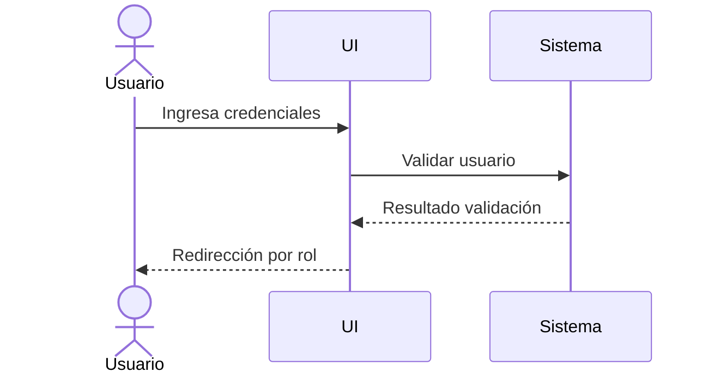
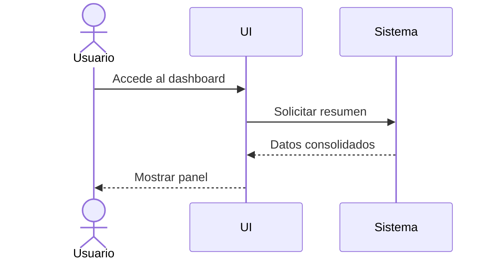
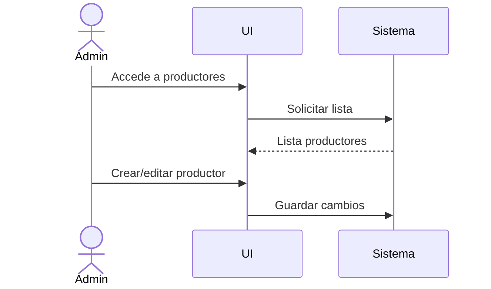
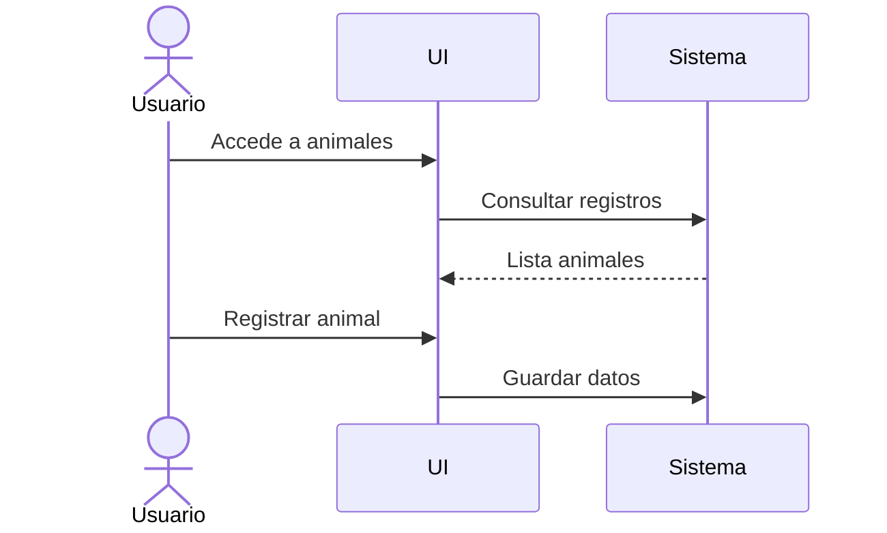
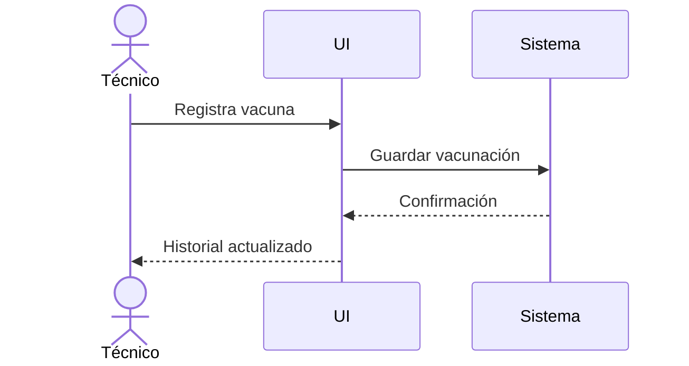
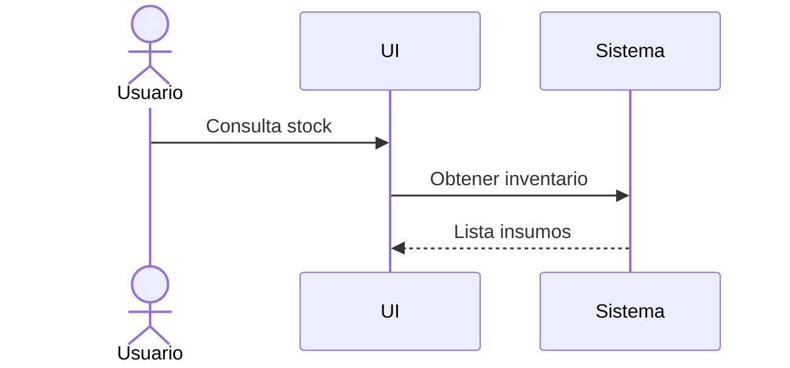
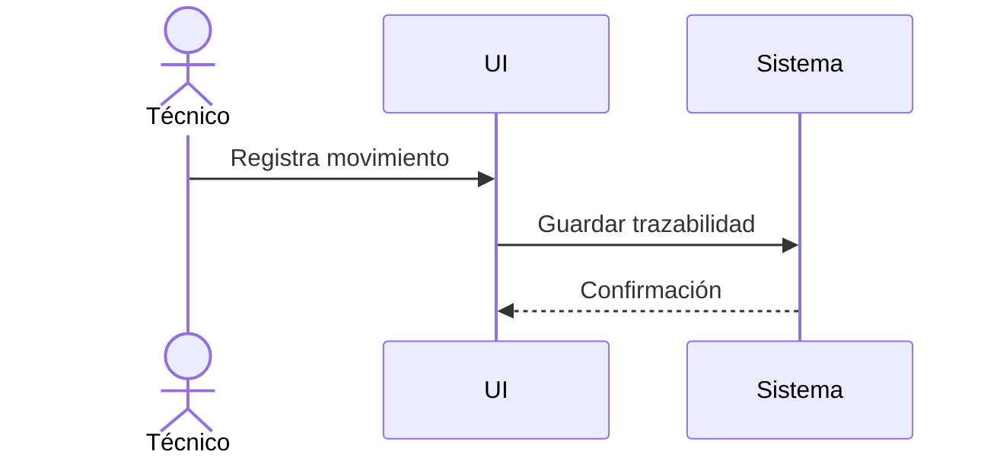
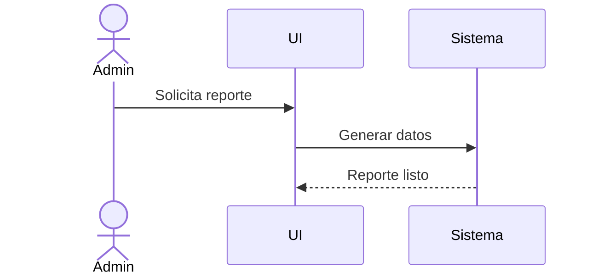
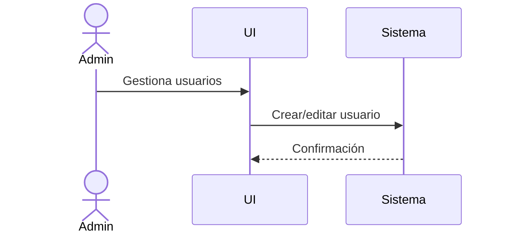
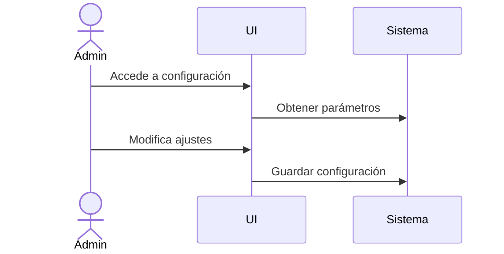

1. Pantalla de Login
Objetivo

Iniciar sesión y redirigir según rol.

Wireframe
+----------------------------------+
|        GANADAPP MALARGÜE           |
+----------------------------------+
| Usuario:   [______________]      |
| Contraseña:[______________]      |
|                                  |
|        [ Ingresar ]              |
|                                  |
|  ¿Olvidó su contraseña?          |
+----------------------------------+

Flujo 

UX
Campos mínimos
Mensajes de error claros
Redirección automática por rol
2. Dashboard (Panel principal)
Objetivo

Visualizar estado general del sistema.

Wireframe
+--------------------------------------+
| LOGO | DASHBOARD | usuario          |
+--------------------------------------+
| MENU | RESUMEN PRINCIPAL            |
|      | - Animales: 120             |
|      | - Vacunas pendientes: 8     |
|      | - Stock crítico: 3          |
|      |                             |
|      | ALERTAS                     |
|      | [Vacunación próxima]       |
|      | [Stock bajo]               |
+--------------------------------------+
Flujo

UX
Información crítica priorizada
Tarjetas simples
Visión rápida del estado general
3. Gestión de Productores
Objetivo

Administrar productores registrados.

Wireframe
+------------------------------+
| PRODUCTORES                 |
+------------------------------+
| [+ Nuevo productor]         |
|                              |
| Nombre | Tel | Localidad    |
|-----------------------------|
| Juan   | xxx | Malargüe    |
| Ana    | xxx | Bardas      |
+------------------------------+
Flujo

4. Gestión de Animales
Objetivo

Administrar animales y su estado sanitario.

Wireframe
+------------------------------+
| ANIMALES                   |
+------------------------------+
| [+ Nuevo animal]            |
|-----------------------------|
| ID | Raza | Estado | Estab. |
|-----------------------------|
| 01 | Angus| Sano   | Campo1 |
+------------------------------+
Flujo

UX
Identificación por ID único
Estado visible claramente
5. Vacunación / Sanidad
Objetivo

Registrar y consultar vacunación.

Wireframe
+------------------------------+
| VACUNACIÓN                |
+------------------------------+
| Animal: [_____]             |
| Vacuna: [_____]             |
| Fecha:  [_____]             |
|                              |
| [Registrar]                 |
|-----------------------------|
| Historial                  |
| Animal | Vacuna | Fecha    |
+------------------------------+
Flujo

6. Stock de insumos
Objetivo

Controlar inventario.

Wireframe
+------------------------------+
| STOCK                     |
+------------------------------+
| [+ Nuevo insumo]           |
|-----------------------------|
| Insumo | Cantidad | Estado |
|-----------------------------|
| Vacuna | 10       | OK     |
| Alim   | 2        | BAJO   |
+------------------------------+
Flujo

7. Movimientos de ganado
Objetivo

Registrar trazabilidad.

Wireframe
+------------------------------+
| MOVIMIENTOS             |
+------------------------------+
| Animal: [___]              |
| Origen: [___]              |
| Destino:[___]              |
| Fecha:  [___]              |
| [Registrar]               |
+------------------------------+
Flujo

8. Reportes
Objetivo

Generar análisis del sistema.

Wireframe
+------------------------------+
| REPORTES                |
+------------------------------+
| [Ganado total]             |
| [Sanidad]                 |
| [Stock]                   |
|                            |
| [Exportar PDF]            |
+------------------------------+
Flujo

9. Usuarios y roles
Objetivo

Administrar usuarios del sistema.

Flujo

10. Configuración del sistema
Objetivo

Configurar parámetros generales.

Flujo
